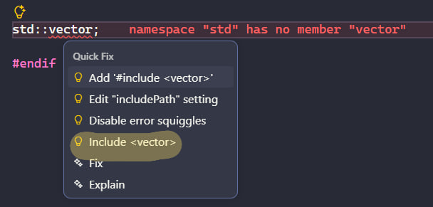

# includski

Small project to learn TypeScript. It's a VS Code extension that offers a Quick Fix to insert the right C++ standard-library `#include` for a `std::` name (or a known global like `INT_MAX`, `uint32_t`) under the cursor — no clangd or compile_commands needed.

## Install

```bash
git clone https://github.com/1mache/includski.git
cd includski
npm install
```

## Run in your real VS Code (always-on)

`F5` only starts a throwaway Extension Development Host — closes when you close that window. To have `includski` active in your normal VS Code every time:

```bash
npm install -g @vscode/vsce   # one-time, packaging CLI
npm run compile
vsce package                  # produces includski-0.0.1.vsix
code --install-extension includski-0.0.1.vsix
```

Reload VS Code (`Ctrl+Shift+P` → "Developer: Reload Window"). The extension now activates on its own for any `.cpp` file, same as any installed extension.

After you change the code, re-run `vsce package` + `code --install-extension` (add `--force` to overwrite) to update it.

## Debug / develop

Open the folder in VS Code, then press `F5` (or Run → Start Debugging). This launches a separate Extension Development Host window with `includski` active, for testing changes without touching your real install.



## Other useful commands

```bash
npm run compile     # build once
npm run watch        # rebuild on file change
npm run lint         # lint src/
npm test             # run extension tests
npm run test:unit    # run unit tests only
```
